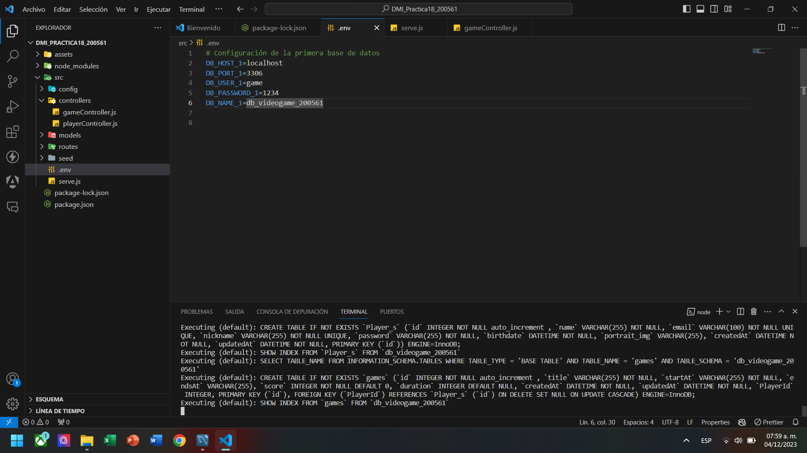

# DMI_Practica19_200561

  
# Universidad Tecnológica de Xicotepec de Juárez

## Ingeniería en Desarrollo y Gestión de Software
## Elisama Arturo Calva Moreno
## 10A
### Desarrollo Móvil Integral

## Capturas de Pantalla

  
  
  
  
  
  
  
  
  

&nbsp;
&nbsp;

|  Característica |  Información |
| :------------: | :------------: |
| Nombre  |  Practica 19: Importar y eliminar los datos de juegos y jugadores a la base de datos. |
| Descripción  | Esta aplicación con el nombre de API_VIDEOGAME para la aplicación del videojuego, es un CRUD que se conectara a la aplicación integradora, pero ¿Que es un CRUD? Un CRUD es el acrónimo de "Crear, Leer, Actualizar y Borrar", que se usa para referirse a las funciones básicas en bases de datos o la capa de persistencia en un software, en pocas palabras es un acrónimo para las maneras en las que se puede operar sobre información almacenada, se tiene como meta poder mostrar los avances o evolución del CRUD que tendrá como finalidad poderse conectar a la API del equipo FOUR-GAME, en este nuevo avance se realizo la incorporación de poder insertar una lisita de datos completos de usuarios por medio de comandos, y también una forma de eliminarlos. |
|  Fecha de Carga | 04/12/23  |

&nbsp;
&nbsp;

&nbsp;
&nbsp;

 
 
 
 

&nbsp;
&nbsp;
